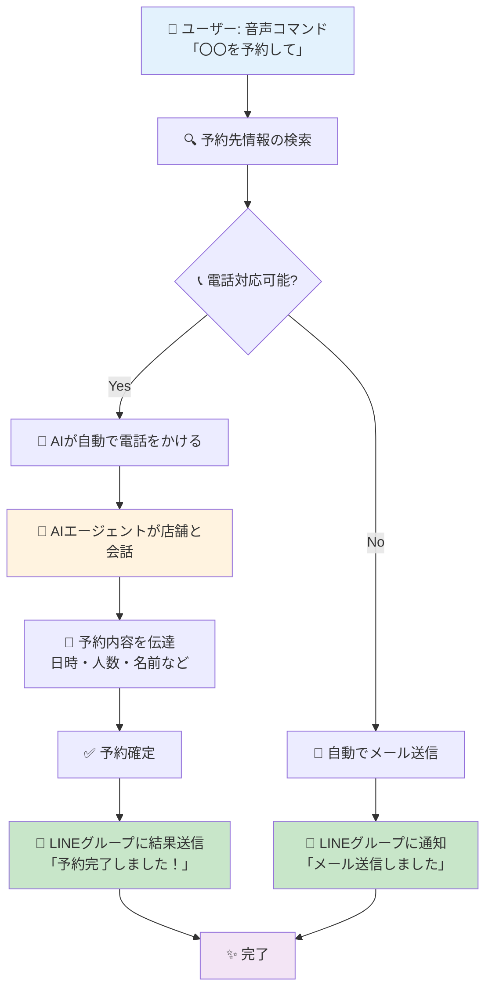
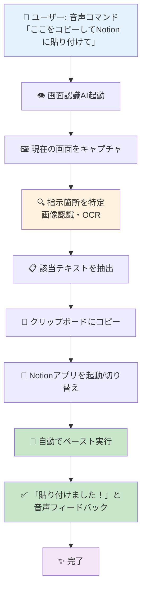

# Voice OS 活用アイデア提案

## 概要
このドキュメントでは、Voice OSを活用した2つの革新的な機能アイデアを提案します。
どちらも「音声コマンドだけで複雑な作業を完結させる」というコンセプトで、日常の面倒な作業を大幅に効率化します。

---

## アイデア1: 音声コマンド式 電話予約ツール

### 解決する課題
- 予約の電話をかけるのが面倒
- 友人との予定共有に手間がかかる
- 予約後にグループLINEで報告するのを忘れる

### 機能概要
**「〇〇を予約して」と一言言うだけで、AIが自動で電話予約を完了し、結果をLINEグループに送信**

### 処理フロー



### 詳細ステップ

#### 1. 音声コマンド入力
- ユーザーが「〇〇（店名や施設名）を予約して」と発話
- Voice OSが音声を認識し、予約プロセスを起動

#### 2. 予約先情報の検索
- Web検索やデータベースから予約先の情報を取得
- 電話番号、営業時間、予約可能な時間帯などを確認

#### 3. 電話 or メール判定
- **電話対応可能な場合**: 自動電話ルートへ
- **電話対応不可の場合**: メール送信ルートへ

#### 4. AIエージェントによる自動電話予約
- AIが実際に電話をかける
- 店舗側の応答（「お電話ありがとうございます」など）を認識
- AIが自然な会話で予約を進行
  - 「予約をお願いしたいのですが」
  - 「〇月〇日の〇時で〇名でお願いします」
  - 「名前は〇〇です」
- リアルタイムで会話内容を理解し、適切に応答

#### 5. 予約確定 & 結果通知
- 予約が確定したら、詳細情報をLINEグループに自動送信
- メッセージ例:
  ```
  ✅ 予約完了しました！
  【店名】〇〇レストラン
  【日時】4月5日 19:00
  【人数】4名
  【予約者名】山田太郎
  ```

#### 6. メール送信ルート（電話不可の場合）
- 予約先のメールアドレス宛に予約依頼メールを自動作成・送信
- LINEグループに「メール送信完了」を通知

### 期待される効果
- 🎯 **予約の手間がゼロに**: 音声コマンド1回で完結
- 👥 **グループ共有が自動化**: LINEで報告する手間を削減
- ⏰ **時間の節約**: 電話をかける時間が不要

---

## アイデア2: VoiceOS 画面認識式 単語帳自動貼り付け機能

### 解決する課題
- 単語帳のPDFから単語をコピー&ペーストする作業が面倒
- 学習ツール（Notionなど）に転記する手間がかかる
- マウスやキーボード操作が多く、学習のテンポが悪い

### 機能概要
**「ここの部分をコピーしてNotionに貼り付けて」と音声で指示するだけで、画面上のテキストを自動コピー&貼り付け**

### 処理フロー



### 詳細ステップ

#### 1. 音声コマンド入力
- ユーザーが単語帳PDFを開いている状態で発話
- 「ここの部分を」「この単語を」などの指示語を認識
- 対象アプリ（Notion、Anki、Googleドキュメントなど）も音声で指定

#### 2. 画面認識AI起動
- Voice OSの画面認識機能が作動
- 現在表示されている画面全体をキャプチャ

#### 3. 指示箇所の特定
- **画像認識技術**を使用して、ユーザーが指している箇所を推測
  - 直前にカーソルがあった位置
  - 音声のトーン/タイミングから推測
  - 「ここ」と言った時のマウス位置
- OCR（光学文字認識）でテキストを読み取り

#### 4. テキスト抽出 & コピー
- 特定した箇所のテキストをデジタルデータとして抽出
- システムのクリップボードに自動コピー

#### 5. 対象アプリに貼り付け
- 指定されたアプリ（Notionなど）を自動で開く
- すでに開いている場合はウィンドウを切り替え
- カーソル位置に自動でペースト（Ctrl+V / Cmd+V）

#### 6. フィードバック
- 音声で「貼り付けました！」と確認
- 必要に応じて画面上にも通知を表示

### 使用例

#### 例1: PDFからNotionへ
```
[PDF単語帳を開いている状態]
ユーザー: 「この単語をコピーしてNotionに貼り付けて」
→ "Serendipity" がNotionの単語リストに自動追加
```

#### 例2: 複数単語を連続処理
```
ユーザー: 「次の5個の単語をコピーしてAnkiに追加して」
→ 5つの単語が順番にAnkiのデッキに追加される
```

#### 例3: 定義文ごとコピー
```
ユーザー: 「この単語と意味をまとめてGoogleドキュメントに貼り付けて」
→ "Serendipity: 思いがけない幸運な発見" が貼り付けられる
```

### 技術的なポイント

#### 画面認識
- スクリーンショットAPI（OS標準機能）
- OCRライブラリ（Tesseract、Apple Vision Frameworkなど）
- 座標指定やテキスト領域の自動検出

#### アプリ連携
- OS標準のAutomation機能（AppleScript、Windows PowerShellなど）
- アプリのURLスキームやAPI連携
- クリップボード操作のシステムコール

#### 音声処理
- コンテキスト理解（「ここ」「この」などの指示語）
- アプリ名認識（Notion、Anki、Google Docsなど）
- 数量認識（「5個」「3つ」など）

### 期待される効果
- 🚀 **学習効率の大幅向上**: コピペ作業から解放
- 🎤 **ハンズフリー学習**: キーボード・マウス不要
- 🎯 **集中力維持**: 作業の中断が減る
- 📚 **単語管理の習慣化**: 面倒さがなくなり継続しやすい

---

## 両機能に共通するVoice OSの強み

### 1. マルチステップ自動化
従来は手動で何段階もの操作が必要だった作業を、音声コマンド1回で完結

### 2. コンテキスト理解
「ここ」「これ」などの曖昧な指示語でも、画面状況から意図を推測

### 3. 外部サービス連携
電話システム、LINE、Notion、メールなど、様々なサービスと自動連携

### 4. 自然な対話
人間が話すような自然な言葉で指示できる（定型文不要）

---

## 実装に向けた技術要素

### 必要なAPI・サービス
- **音声認識**: Voice OS標準機能
- **電話システム**: Twilio API / VoIP連携
- **AI対話**: OpenAI GPT / Claude API
- **LINE連携**: LINE Messaging API
- **画面認識**: OS標準 + OCRライブラリ
- **アプリ操作**: Automation API（各OS）

### 開発の難易度
| 要素 | 難易度 | 備考 |
|------|--------|------|
| 音声コマンド認識 | ⭐️ | Voice OS標準機能で対応可能 |
| 電話発信機能 | ⭐️⭐️⭐️ | Twilio等のAPI連携が必要 |
| AI対話制御 | ⭐️⭐️⭐️⭐️ | 自然な会話のロジック構築が難関 |
| LINE送信 | ⭐️⭐️ | API連携は比較的容易 |
| 画面認識・OCR | ⭐️⭐️⭐️ | 認識精度の調整が必要 |
| アプリ自動操作 | ⭐️⭐️⭐️ | OSごとの対応が必要 |

---

## まとめ

この2つのアイデアは、**Voice OSの「音声で全てをコントロールする」という強みを最大限に活かした機能**です。

### 電話予約ツールの価値
複雑な電話予約プロセスを完全自動化し、グループ共有まで一気通貫で実現

### 単語帳機能の価値
学習中のコピペ作業をゼロにし、勉強のリズムを途切れさせない

両機能とも、「面倒な作業を音声コマンド1回で完結」というユーザー体験を提供し、Voice OSの可能性を大きく広げるものです。

---

**作成日**: 2026年4月2日  
**ハッカソン**: Voice OS Hackathon (4/3開催)  
**対象**: チーム内アイデア共有
